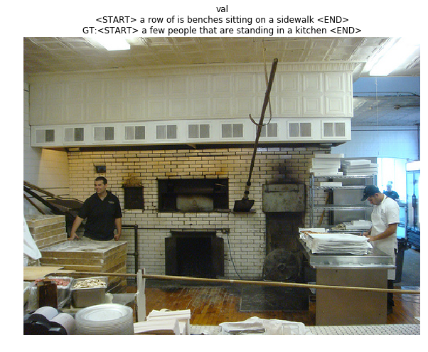

# Image Captioning with LSTMs


```

            "A close up of plates of food"

                                      - by LSTM
                            
```

---
In this project, I implemented the LSTM update rule and use it for image captioning.


```python
# As usual, a bit of setup

import time, os, json
import numpy as np
import matplotlib.pyplot as plt

from cs231n.gradient_check import eval_numerical_gradient, eval_numerical_gradient_array
from cs231n.rnn_layers import *
from cs231n.captioning_solver import CaptioningSolver
from cs231n.classifiers.rnn import CaptioningRNN
from cs231n.coco_utils import load_coco_data, sample_coco_minibatch, decode_captions
from cs231n.image_utils import image_from_url

%matplotlib inline
plt.rcParams['figure.figsize'] = (10.0, 8.0) # set default size of plots
plt.rcParams['image.interpolation'] = 'nearest'
plt.rcParams['image.cmap'] = 'gray'

# for auto-reloading external modules
# see http://stackoverflow.com/questions/1907993/autoreload-of-modules-in-ipython
%load_ext autoreload
%autoreload 2

def rel_error(x, y):
  """ returns relative error """
  return np.max(np.abs(x - y) / (np.maximum(1e-8, np.abs(x) + np.abs(y))))
```

# Load MS-COCO data
As in the previous notebook, we will use the Microsoft COCO dataset for captioning.


```python
# Load COCO data from disk; this returns a dictionary
# We'll work with dimensionality-reduced features for this notebook, but feel
# free to experiment with the original features by changing the flag below.
data = load_coco_data(pca_features=True)

# Print out all the keys and values from the data dictionary
for k, v in data.iteritems():
  if type(v) == np.ndarray:
    print k, type(v), v.shape, v.dtype
  else:
    print k, type(v), len(v)
```

    idx_to_word <type 'list'> 1004
    train_captions <type 'numpy.ndarray'> (400135, 17) int32
    val_captions <type 'numpy.ndarray'> (195954, 17) int32
    train_image_idxs <type 'numpy.ndarray'> (400135,) int32
    val_features <type 'numpy.ndarray'> (40504, 512) float32
    val_image_idxs <type 'numpy.ndarray'> (195954,) int32
    train_features <type 'numpy.ndarray'> (82783, 512) float32
    train_urls <type 'numpy.ndarray'> (82783,) |S63
    val_urls <type 'numpy.ndarray'> (40504,) |S63
    word_to_idx <type 'dict'> 1004


# LSTM
If you read recent papers, you'll see that many people use a variant on the vanialla RNN called Long-Short Term Memory (LSTM) RNNs. Vanilla RNNs can be tough to train on long sequences due to vanishing and exploding gradiants caused by repeated matrix multiplication. LSTMs solve this problem by replacing the simple update rule of the vanilla RNN with a gating mechanism as follows.

Similar to the vanilla RNN, at each timestep we receive an input $x_t\in\mathbb{R}^D$ and the previous hidden state $h_{t-1}\in\mathbb{R}^H$; the LSTM also maintains an $H$-dimensional *cell state*, so we also receive the previous cell state $c_{t-1}\in\mathbb{R}^H$. The learnable parameters of the LSTM are an *input-to-hidden* matrix $W_x\in\mathbb{R}^{4H\times D}$, a *hidden-to-hidden* matrix $W_h\in\mathbb{R}^{4H\times H}$ and a *bias vector* $b\in\mathbb{R}^{4H}$.

At each timestep we first compute an *activation vector* $a\in\mathbb{R}^{4H}$ as $a=W_xx_t + W_hh_{t-1}+b$. We then divide this into four vectors $a_i,a_f,a_o,a_g\in\mathbb{R}^H$ where $a_i$ consists of the first $H$ elements of $a$, $a_f$ is the next $H$ elements of $a$, etc. We then compute the *input gate* $g\in\mathbb{R}^H$, *forget gate* $f\in\mathbb{R}^H$, *output gate* $o\in\mathbb{R}^H$ and *block input* $g\in\mathbb{R}^H$ as

$$
\begin{align*}
i = \sigma(a_i) \hspace{2pc}
f = \sigma(a_f) \hspace{2pc}
o = \sigma(a_o) \hspace{2pc}
g = \tanh(a_g)
\end{align*}
$$

where $\sigma$ is the sigmoid function and $\tanh$ is the hyperbolic tangent, both applied elementwise.

Finally we compute the next cell state $c_t$ and next hidden state $h_t$ as

$$
c_{t} = f\odot c_{t-1} + i\odot g \hspace{4pc}
h_t = o\odot\tanh(c_t)
$$

where $\odot$ is the elementwise product of vectors.

In the rest of the notebook we will implement the LSTM update rule and apply it to the image captioning task.

# LSTM: step forward
Implement the forward pass for a single timestep of an LSTM in the `lstm_step_forward` function in the file `cs231n/rnn_layers.py`. This should be similar to the `rnn_step_forward` function that you implemented above, but using the LSTM update rule instead.

Once you are done, run the following to perform a simple test of your implementation. You should see errors around `1e-8` or less.


```python
N, D, H = 3, 4, 5
x = np.linspace(-0.4, 1.2, num=N*D).reshape(N, D)
prev_h = np.linspace(-0.3, 0.7, num=N*H).reshape(N, H)
prev_c = np.linspace(-0.4, 0.9, num=N*H).reshape(N, H)
Wx = np.linspace(-2.1, 1.3, num=4*D*H).reshape(D, 4 * H)
Wh = np.linspace(-0.7, 2.2, num=4*H*H).reshape(H, 4 * H)
b = np.linspace(0.3, 0.7, num=4*H)

next_h, next_c, cache = lstm_step_forward(x, prev_h, prev_c, Wx, Wh, b)

expected_next_h = np.asarray([
    [ 0.24635157,  0.28610883,  0.32240467,  0.35525807,  0.38474904],
    [ 0.49223563,  0.55611431,  0.61507696,  0.66844003,  0.7159181 ],
    [ 0.56735664,  0.66310127,  0.74419266,  0.80889665,  0.858299  ]])
expected_next_c = np.asarray([
    [ 0.32986176,  0.39145139,  0.451556,    0.51014116,  0.56717407],
    [ 0.66382255,  0.76674007,  0.87195994,  0.97902709,  1.08751345],
    [ 0.74192008,  0.90592151,  1.07717006,  1.25120233,  1.42395676]])

print 'next_h error: ', rel_error(expected_next_h, next_h)
print 'next_c error: ', rel_error(expected_next_c, next_c)
```

    next_h error:  5.70541311858e-09
    next_c error:  5.81431230888e-09


#LSTM: step backward
Implement the backward pass for a single LSTM timestep in the function `lstm_step_backward` in the file `cs231n/rnn_layers.py`. Once you are done, run the following to perform numeric gradient checking on your implementation. You should see errors around `1e-8` or less.


```python
N, D, H = 4, 5, 6
x = np.random.randn(N, D)
prev_h = np.random.randn(N, H)
prev_c = np.random.randn(N, H)
Wx = np.random.randn(D, 4 * H)
Wh = np.random.randn(H, 4 * H)
b = np.random.randn(4 * H)

next_h, next_c, cache = lstm_step_forward(x, prev_h, prev_c, Wx, Wh, b)

dnext_h = np.random.randn(*next_h.shape)
dnext_c = np.random.randn(*next_c.shape)

fx_h = lambda x: lstm_step_forward(x, prev_h, prev_c, Wx, Wh, b)[0]
fh_h = lambda h: lstm_step_forward(x, prev_h, prev_c, Wx, Wh, b)[0]
fc_h = lambda c: lstm_step_forward(x, prev_h, prev_c, Wx, Wh, b)[0]
fWx_h = lambda Wx: lstm_step_forward(x, prev_h, prev_c, Wx, Wh, b)[0]
fWh_h = lambda Wh: lstm_step_forward(x, prev_h, prev_c, Wx, Wh, b)[0]
fb_h = lambda b: lstm_step_forward(x, prev_h, prev_c, Wx, Wh, b)[0]

fx_c = lambda x: lstm_step_forward(x, prev_h, prev_c, Wx, Wh, b)[1]
fh_c = lambda h: lstm_step_forward(x, prev_h, prev_c, Wx, Wh, b)[1]
fc_c = lambda c: lstm_step_forward(x, prev_h, prev_c, Wx, Wh, b)[1]
fWx_c = lambda Wx: lstm_step_forward(x, prev_h, prev_c, Wx, Wh, b)[1]
fWh_c = lambda Wh: lstm_step_forward(x, prev_h, prev_c, Wx, Wh, b)[1]
fb_c = lambda b: lstm_step_forward(x, prev_h, prev_c, Wx, Wh, b)[1]

num_grad = eval_numerical_gradient_array

dx_num = num_grad(fx_h, x, dnext_h) + num_grad(fx_c, x, dnext_c)
dh_num = num_grad(fh_h, prev_h, dnext_h) + num_grad(fh_c, prev_h, dnext_c)
dc_num = num_grad(fc_h, prev_c, dnext_h) + num_grad(fc_c, prev_c, dnext_c)
dWx_num = num_grad(fWx_h, Wx, dnext_h) + num_grad(fWx_c, Wx, dnext_c)
dWh_num = num_grad(fWh_h, Wh, dnext_h) + num_grad(fWh_c, Wh, dnext_c)
db_num = num_grad(fb_h, b, dnext_h) + num_grad(fb_c, b, dnext_c)

dx, dh, dc, dWx, dWh, db = lstm_step_backward(dnext_h, dnext_c, cache)

print 'dx error: ', rel_error(dx_num, dx)
print 'dh error: ', rel_error(dh_num, dh)
print 'dc error: ', rel_error(dc_num, dc)
print 'dWx error: ', rel_error(dWx_num, dWx)
print 'dWh error: ', rel_error(dWh_num, dWh)
print 'db error: ', rel_error(db_num, db)
```

    dx error:  4.64229864167e-09
    dh error:  3.24888154905e-10
    dc error:  6.84694917362e-10
    dWx error:  3.02606402331e-08
    dWh error:  3.31939419225e-09
    db error:  1.0070800315e-09


# LSTM: forward
In the function `lstm_forward` in the file `cs231n/rnn_layers.py`, implement the `lstm_forward` function to run an LSTM forward on an entire timeseries of data.

When you are done run the following to check your implementation. You should see an error around `1e-7`.


```python
N, D, H, T = 2, 5, 4, 3
x = np.linspace(-0.4, 0.6, num=N*T*D).reshape(N, T, D)
h0 = np.linspace(-0.4, 0.8, num=N*H).reshape(N, H)
Wx = np.linspace(-0.2, 0.9, num=4*D*H).reshape(D, 4 * H)
Wh = np.linspace(-0.3, 0.6, num=4*H*H).reshape(H, 4 * H)
b = np.linspace(0.2, 0.7, num=4*H)

h, cache = lstm_forward(x, h0, Wx, Wh, b)

expected_h = np.asarray([
 [[ 0.01764008,  0.01823233,  0.01882671,  0.0194232 ],
  [ 0.11287491,  0.12146228,  0.13018446,  0.13902939],
  [ 0.31358768,  0.33338627,  0.35304453,  0.37250975]],
 [[ 0.45767879,  0.4761092,   0.4936887,   0.51041945],
  [ 0.6704845,   0.69350089,  0.71486014,  0.7346449 ],
  [ 0.81733511,  0.83677871,  0.85403753,  0.86935314]]])

print 'h error: ', rel_error(expected_h, h)
```

    h error:  8.61053745211e-08


# LSTM: backward
Implement the backward pass for an LSTM over an entire timeseries of data in the function `lstm_backward` in the file `cs231n/rnn_layers.py`. When you are done run the following to perform numeric gradient checking on your implementation. You should see errors around `1e-8` or less.


```python
from cs231n.rnn_layers import lstm_forward, lstm_backward

N, D, T, H = 2, 3, 10, 6

x = np.random.randn(N, T, D)
h0 = np.random.randn(N, H)
Wx = np.random.randn(D, 4 * H)
Wh = np.random.randn(H, 4 * H)
b = np.random.randn(4 * H)

out, cache = lstm_forward(x, h0, Wx, Wh, b)

dout = np.random.randn(*out.shape)

dx, dh0, dWx, dWh, db = lstm_backward(dout, cache)

fx = lambda x: lstm_forward(x, h0, Wx, Wh, b)[0]
fh0 = lambda h0: lstm_forward(x, h0, Wx, Wh, b)[0]
fWx = lambda Wx: lstm_forward(x, h0, Wx, Wh, b)[0]
fWh = lambda Wh: lstm_forward(x, h0, Wx, Wh, b)[0]
fb = lambda b: lstm_forward(x, h0, Wx, Wh, b)[0]

dx_num = eval_numerical_gradient_array(fx, x, dout)
dh0_num = eval_numerical_gradient_array(fh0, h0, dout)
dWx_num = eval_numerical_gradient_array(fWx, Wx, dout)
dWh_num = eval_numerical_gradient_array(fWh, Wh, dout)
db_num = eval_numerical_gradient_array(fb, b, dout)

print 'dx error: ', rel_error(dx_num, dx)
print 'dh0 error: ', rel_error(dh0_num, dh0)
print 'dWx error: ', rel_error(dWx_num, dWx)
print 'dWh error: ', rel_error(dWh_num, dWh)
print 'db error: ', rel_error(db_num, db)
```

    dx error:  2.08939707132e-09
    dh0 error:  8.43723255936e-10
    dWx error:  2.29469044165e-08
    dWh error:  1.03609986303e-08
    db error:  7.99024444152e-10


#LSTM captioning model
Now that you have implemented an LSTM, update the implementation of the `loss` method of the `CaptioningRNN` class in the file `cs231n/classifiers/rnn.py` to handle the case where `self.cell_type` is `lstm`. This should require adding less than 10 lines of code.

Once you have done so, run the following to check your implementation. You should see a difference of less than `1e-10`.


```python
N, D, W, H = 10, 20, 30, 40
word_to_idx = {'<NULL>': 0, 'cat': 2, 'dog': 3}
V = len(word_to_idx)
T = 13

model = CaptioningRNN(word_to_idx,
          input_dim=D,
          wordvec_dim=W,
          hidden_dim=H,
          cell_type='lstm',
          dtype=np.float64)

# Set all model parameters to fixed values
for k, v in model.params.iteritems():
  model.params[k] = np.linspace(-1.4, 1.3, num=v.size).reshape(*v.shape)

features = np.linspace(-0.5, 1.7, num=N*D).reshape(N, D)
captions = (np.arange(N * T) % V).reshape(N, T)

loss, grads = model.loss(features, captions)
expected_loss = 9.82445935443

print 'loss: ', loss
print 'expected loss: ', expected_loss
print 'difference: ', abs(loss - expected_loss)
```

    loss:  9.82445935443
    expected loss:  9.82445935443
    difference:  2.26130225656e-12


# Overfit LSTM captioning model
Run the following to overfit an LSTM captioning model on the same small dataset as we used for the RNN above.


```python
small_data = load_coco_data(max_train=50)

small_lstm_model = CaptioningRNN(
          cell_type='lstm',
          word_to_idx=data['word_to_idx'],
          input_dim=data['train_features'].shape[1],
          hidden_dim=512,
          wordvec_dim=256,
          dtype=np.float32,
        )

small_lstm_solver = CaptioningSolver(small_lstm_model, small_data,
           update_rule='adam',
           num_epochs=50,
           batch_size=25,
           optim_config={
             'learning_rate': 5e-3,
           },
           lr_decay=0.995,
           verbose=True, print_every=10,
         )

small_lstm_solver.train()

# Plot the training losses
plt.plot(small_lstm_solver.loss_history)
plt.xlabel('Iteration')
plt.ylabel('Loss')
plt.title('Training loss history')
plt.show()
```

    (Iteration 1 / 100) loss: 74.877689
    (Iteration 11 / 100) loss: 44.866224
    (Iteration 21 / 100) loss: 19.357536
    (Iteration 31 / 100) loss: 12.859674
    (Iteration 41 / 100) loss: 4.712009
    (Iteration 51 / 100) loss: 4.856779
    (Iteration 61 / 100) loss: 1.276186
    (Iteration 71 / 100) loss: 0.576924
    (Iteration 81 / 100) loss: 0.266341
    (Iteration 91 / 100) loss: 0.188474


# LSTM test-time sampling
Modify the `sample` method of the `CaptioningRNN` class to handle the case where `self.cell_type` is `lstm`. This should take fewer than 10 lines of code.

When you are done run the following to sample from your overfit LSTM model on some training and validation set samples.


```python
for split in ['train', 'val']:
  minibatch = sample_coco_minibatch(small_data, split=split, batch_size=12)
  gt_captions, features, urls = minibatch
  gt_captions = decode_captions(gt_captions, data['idx_to_word'])

  sample_captions = small_lstm_model.sample(features)
  sample_captions = decode_captions(sample_captions, data['idx_to_word'])

  for gt_caption, sample_caption, url in zip(gt_captions, sample_captions, urls):
    plt.imshow(image_from_url(url))
    plt.title('%s\n%s\nGT:%s' % (split, sample_caption, gt_caption))
    plt.axis('off')
    plt.show()
```


    IOPub data rate exceeded.
    The notebook server will temporarily stop sending output
    to the client in order to avoid crashing it.
    To change this limit, set the config variable
    `--NotebookApp.iopub_data_rate_limit`.





# Train a good captioning model!
Using the pieces you have implemented in this and the previous notebook, try to train a captioning model that gives decent qualitative results (better than the random garbage you saw with the overfit models) when sampling on the validation set. You can subsample the training set if you want; we just want to see samples on the validatation set that are better than random.

Don't spend too much time on this part; we don't have any explicit accuracy thresholds you need to meet.


```python
mid_data = load_coco_data(max_train=500)

mid_lstm_model = CaptioningRNN(
          cell_type='lstm',
          word_to_idx=data['word_to_idx'],
          input_dim=data['train_features'].shape[1],
          hidden_dim=512,
          wordvec_dim=256,
          dtype=np.float32,
        )

mid_lstm_solver = CaptioningSolver(mid_lstm_model, mid_data,
           update_rule='adam',
           num_epochs=50,
           batch_size=25,
           optim_config={
             'learning_rate': 5e-3,
           },
           lr_decay=0.995,
           verbose=True, print_every=10,
         )

mid_lstm_solver.train()


mid_rnn_model = CaptioningRNN(
          cell_type='rnn',
          word_to_idx=data['word_to_idx'],
          input_dim=data['train_features'].shape[1],
          hidden_dim=512,
          wordvec_dim=256,
          dtype=np.float32,
        )

mid_rnn_solver = CaptioningSolver(mid_rnn_model, mid_data,
           update_rule='adam',
           num_epochs=50,
           batch_size=25,
           optim_config={
             'learning_rate': 5e-3,
           },
           lr_decay=0.995,
           verbose=True, print_every=10,
         )

mid_rnn_solver.train()


# Plot the training losses
plt.plot(mid_lstm_solver.loss_history)
plt.plot(mid_rnn_solver.loss_history)
plt.xlabel('Iteration')
plt.ylabel('Loss')
plt.title('Training loss history')
plt.show()
```

    (Iteration 1 / 1000) loss: 77.879909
    (Iteration 11 / 1000) loss: 53.360881
    (Iteration 21 / 1000) loss: 49.908913
    (Iteration 31 / 1000) loss: 45.739850
    (Iteration 41 / 1000) loss: 40.364055
    (Iteration 51 / 1000) loss: 36.034343
    (Iteration 61 / 1000) loss: 31.433491
    (Iteration 71 / 1000) loss: 31.693729
    (Iteration 81 / 1000) loss: 21.617272
    (Iteration 91 / 1000) loss: 19.748759
    (Iteration 101 / 1000) loss: 17.897554
    (Iteration 111 / 1000) loss: 15.989801
    (Iteration 121 / 1000) loss: 16.856024
    (Iteration 131 / 1000) loss: 13.371483
    (Iteration 141 / 1000) loss: 12.625586
    (Iteration 151 / 1000) loss: 12.086538
    (Iteration 161 / 1000) loss: 10.012720
    (Iteration 171 / 1000) loss: 6.930094
    (Iteration 181 / 1000) loss: 5.960172
    (Iteration 191 / 1000) loss: 3.703816
    (Iteration 201 / 1000) loss: 4.217136
    (Iteration 211 / 1000) loss: 3.820096
    (Iteration 221 / 1000) loss: 3.524500
    (Iteration 231 / 1000) loss: 3.505624
    (Iteration 241 / 1000) loss: 1.875615
    (Iteration 251 / 1000) loss: 2.452734
    (Iteration 261 / 1000) loss: 3.141698
    (Iteration 271 / 1000) loss: 1.685207
    (Iteration 281 / 1000) loss: 0.990166
    (Iteration 291 / 1000) loss: 1.495005
    (Iteration 301 / 1000) loss: 0.840847
    (Iteration 311 / 1000) loss: 0.749375
    (Iteration 321 / 1000) loss: 0.873023
    (Iteration 331 / 1000) loss: 0.317213
    (Iteration 341 / 1000) loss: 0.395441
    (Iteration 351 / 1000) loss: 0.262595
    (Iteration 361 / 1000) loss: 0.208086
    (Iteration 371 / 1000) loss: 0.166235
    (Iteration 381 / 1000) loss: 0.132030
    (Iteration 391 / 1000) loss: 0.381404
    (Iteration 401 / 1000) loss: 0.109229
    (Iteration 411 / 1000) loss: 0.111242
    (Iteration 421 / 1000) loss: 0.082869
    (Iteration 431 / 1000) loss: 0.084919
    (Iteration 441 / 1000) loss: 0.082310
    (Iteration 451 / 1000) loss: 0.077852
    (Iteration 461 / 1000) loss: 0.070571
    (Iteration 471 / 1000) loss: 0.062679
    (Iteration 481 / 1000) loss: 0.073653
    (Iteration 491 / 1000) loss: 0.065984
    (Iteration 501 / 1000) loss: 0.050647
    (Iteration 511 / 1000) loss: 0.055700
    (Iteration 521 / 1000) loss: 0.059463
    (Iteration 531 / 1000) loss: 0.055270
    (Iteration 541 / 1000) loss: 0.045531
    (Iteration 551 / 1000) loss: 0.043328
    (Iteration 561 / 1000) loss: 0.050574
    (Iteration 571 / 1000) loss: 0.045243
    (Iteration 581 / 1000) loss: 0.037306
    (Iteration 591 / 1000) loss: 0.043011
    (Iteration 601 / 1000) loss: 0.044089
    (Iteration 611 / 1000) loss: 0.037175
    (Iteration 621 / 1000) loss: 0.039282
    (Iteration 631 / 1000) loss: 0.038004
    (Iteration 641 / 1000) loss: 0.036705
    (Iteration 651 / 1000) loss: 0.033132
    (Iteration 661 / 1000) loss: 0.044654
    (Iteration 671 / 1000) loss: 0.032137
    (Iteration 681 / 1000) loss: 0.032092
    (Iteration 691 / 1000) loss: 0.028900
    (Iteration 701 / 1000) loss: 0.036963
    (Iteration 711 / 1000) loss: 0.026624
    (Iteration 721 / 1000) loss: 0.109143
    (Iteration 731 / 1000) loss: 0.031815
    (Iteration 741 / 1000) loss: 0.028523
    (Iteration 751 / 1000) loss: 0.030499
    (Iteration 761 / 1000) loss: 0.029191
    (Iteration 771 / 1000) loss: 0.029239
    (Iteration 781 / 1000) loss: 0.031739
    (Iteration 791 / 1000) loss: 0.025448
    (Iteration 801 / 1000) loss: 0.026829
    (Iteration 811 / 1000) loss: 0.024152
    (Iteration 821 / 1000) loss: 0.020706
    (Iteration 831 / 1000) loss: 0.025316
    (Iteration 841 / 1000) loss: 0.025626
    (Iteration 851 / 1000) loss: 0.023808
    (Iteration 861 / 1000) loss: 0.026057
    (Iteration 871 / 1000) loss: 0.024756
    (Iteration 881 / 1000) loss: 0.020432
    (Iteration 891 / 1000) loss: 0.021750
    (Iteration 901 / 1000) loss: 0.020922
    (Iteration 911 / 1000) loss: 0.024367
    (Iteration 921 / 1000) loss: 0.021170
    (Iteration 931 / 1000) loss: 0.025575
    (Iteration 941 / 1000) loss: 0.019934
    (Iteration 951 / 1000) loss: 0.020241
    (Iteration 961 / 1000) loss: 0.019470
    (Iteration 971 / 1000) loss: 0.020233
    (Iteration 981 / 1000) loss: 0.018957
    (Iteration 991 / 1000) loss: 0.018518
    (Iteration 1 / 1000) loss: 79.631914
    (Iteration 11 / 1000) loss: 57.961815
    (Iteration 21 / 1000) loss: 50.026348
    (Iteration 31 / 1000) loss: 42.164823
    (Iteration 41 / 1000) loss: 40.006594
    (Iteration 51 / 1000) loss: 29.509233
    (Iteration 61 / 1000) loss: 27.710605
    (Iteration 71 / 1000) loss: 23.679571
    (Iteration 81 / 1000) loss: 24.349892
    (Iteration 91 / 1000) loss: 21.624417
    (Iteration 101 / 1000) loss: 13.535348
    (Iteration 111 / 1000) loss: 18.129485
    (Iteration 121 / 1000) loss: 13.281469
    (Iteration 131 / 1000) loss: 11.748383
    (Iteration 141 / 1000) loss: 13.989912
    (Iteration 151 / 1000) loss: 9.007605
    (Iteration 161 / 1000) loss: 6.664602
    (Iteration 171 / 1000) loss: 5.085775
    (Iteration 181 / 1000) loss: 6.978797
    (Iteration 191 / 1000) loss: 6.162765
    (Iteration 201 / 1000) loss: 4.268124


    ---------------------------------------------------------------------------

    KeyboardInterrupt                         Traceback (most recent call last)

    <ipython-input-42-4174d41fd650> in <module>()
         45          )
         46 
    ---> 47 mid_rnn_solver.train()
         48 
         49 


    /Users/wy/mydata/Works/CNN-for-Visual-Recognition/assignment3/cs231n/captioning_solver.pyc in train(self)
        210 
        211     for t in xrange(num_iterations):
    --> 212       self._step()
        213 
        214       # Maybe print training loss


    /Users/wy/mydata/Works/CNN-for-Visual-Recognition/assignment3/cs231n/captioning_solver.pyc in _step(self)
        153       dw = grads[p]
        154       config = self.optim_configs[p]
    --> 155       next_w, next_config = self.update_rule(w, dw, config)
        156       self.model.params[p] = next_w
        157       self.optim_configs[p] = next_config


    /Users/wy/mydata/Works/CNN-for-Visual-Recognition/assignment3/cs231n/optim.pyc in adam(x, dx, config)
         72   t, m, v = config['t'], config['m'], config['v']
         73   m = beta1 * m + (1 - beta1) * dx
    ---> 74   v = beta2 * v + (1 - beta2) * (dx * dx)
         75   t += 1
         76   alpha = config['learning_rate'] * np.sqrt(1 - beta2 ** t) / (1 - beta1 ** t)


    KeyboardInterrupt: 


```python

plt.plot(mid_lstm_solver.loss_history)
plt.plot(mid_rnn_solver.loss_history)
plt.xlabel('Iteration')
plt.ylabel('Loss')
plt.title('Training loss history')
plt.show()
```


```python
for split in ['train', 'val']:
  minibatch = sample_coco_minibatch(mid_data, split=split, batch_size=5)
  gt_captions, features, urls = minibatch
  gt_captions = decode_captions(gt_captions, data['idx_to_word'])

  sample_rnn_captions = mid_rnn_model.sample(features)
  sample_rnn_captions = decode_captions(sample_rnn_captions, data['idx_to_word'])

  sample_lstm_captions = mid_lstm_model.sample(features)
  sample_lstm_captions = decode_captions(sample_lstm_captions, data['idx_to_word'])

  for gt_caption, sample_rnn_captions, sample_lstm_captions, url in zip(gt_captions, sample_rnn_captions, sample_lstm_captions, urls):
    plt.imshow(image_from_url(url))
    plt.title('%s\nRNN:%s\nLSTM:%s\nGT:%s' % (split, sample_rnn_captions,sample_lstm_captions , gt_caption))
    plt.axis('off')
    plt.show()
```


```python

```
